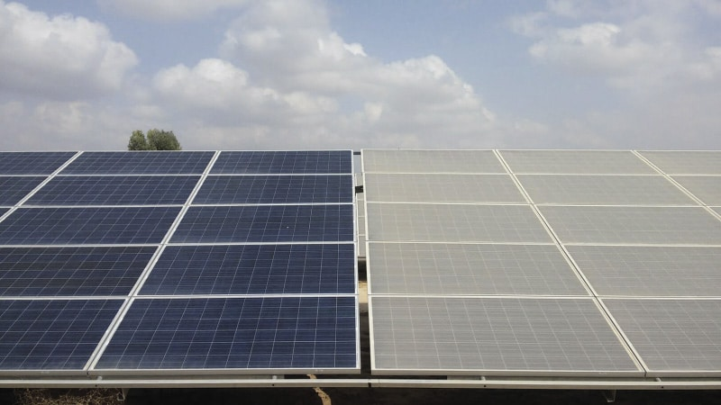

<a></a>


<a></a>




# Dust Detection on Solar Photovoltaics Panel Using Deep Learning Approach
This is a research project submitted to the Faculty of Computer Science and Information Technology, University of Malaya in partial requirements for the Master of Data Science 2024. 

## Project Abstract
The dust detection method on solar photovoltaic panels is important since the solar photovoltaic system will generate less power if the solar panel is dusty. One of the dust detection methods on the solar photovoltaic panel is using a deep learning approach, specifically a computer vision technique using the pre-trained Convolutional Neural Network (CNN) models. Therefore, this project seeks to do dust detection on solar panels by using pre-trained Convolutional Neural Networks (CNN) which are the EfficientNet-BO model, Visual Geometry Group (VGG) -16 model, and Residual Neural Network (ResNet) -50 model. 2 models have been created from each pre-trained Convolutional Neural Network (CNN) models for transfer learning and fine-tuning process, making a total of 6 models that have been experimented. In addition, the dataset of solar panel images has been acquired from the [researcher](https://www.mdpi.com/1996-1073/16/1/155) who created a Convolutional Neural Network for solar, which can be a baseline model to beat since this project were using the same dataset. The result shows Model 2, which is the EfficientNet-BO model that has gone through a transfer learning and fine-tuning process achieved the best result due to its robustness, high accuracy, and high precision. Model 2 also has managed to beat the SolNet model, which was developed by the researcher who provided the dataset used in this research. Future study may take pre-trained Convolutional Neural Network (CNN) model from EfficientNet family into model consideration for any image classification tasks. Lastly, the best model in this research may be a benchmark state-of-the-art (SOTA) model to detect dust on solar photovoltaic panels. 


## Keywords 
Computer Vision, Solar Photovoltaics, EfficientNet-BO, ResNet-50, VGG-16.


## File Descriptions

1. **image/** <br />
   Contains images for streamlit UI and `README.md` file.
2. **README.md** <br />
   Repository documentation
3. **model/** <br />
   Contains `model.h5` and `best_model.json` file.
4. **app_module.py** <br />
   Contains functions for the streamlit web application code in `app.py`.
5. **app.py** <br />
   Script for the streamlit web application
6. **detect-dust-solar-pv.ipynb** <br />
   Kaggle Jupyter Notebook that contains the code for this project. Checkout the notebook [here!](https://www.kaggle.com/code/safwanshamsir99/detect-dust-solar-pv)
7. **requirements.txt** <br />
    Contains list of the libraries and their respective versions required for the project.


### Folder Structure

```
.
├── README.md
├── image/
├── model/
├── .gitignore
├── app_module.py
├── app.py
├── detect-dust-solar-pv.ipynb
└── requirements.txt
```


## Credits
```
@Article{SolNet2022,
AUTHOR = {Onim, Md Saif Hassan and
	Sakif, Zubayar Mahatab Md and
	Ahnaf, Adil and
	Kabir, Ahsan and
	Azad, Abul Kalam and
	Oo, Amanullah Maung Than and
	Afreen, Rafina and
	Hridy, Sumaita Tanjim and
	Hossain, Mahtab and
	Jabid, Taskeed and
	Ali, Md Sawkat},
TITLE = {SolNet: A Convolutional Neural Network for Detecting Dust on Solar Panels},
JOURNAL = {Energies},
VOLUME = {16},
YEAR = {2023},
NUMBER = {1},
ARTICLE-NUMBER = {155},
URL = {https://www.mdpi.com/1996-1073/16/1/155},
ISSN = {1996-1073},
DOI = {10.3390/en16010155}
}
```

Check out the researchers GitHub repositories by clicking this [link.](https://github.com/Onimee58/SolNET)


## Dataset link
I have uploaded the image dataset, open sourced by the researchers on Kaggle (click the Kaggle badge below) for utilization of the free GPUs offered by Kaggle to speed up your computation process.

[](https://www.kaggle.com/datasets/safwanshamsir99/solar-photovoltaics-panell-for-dust-dectection)


